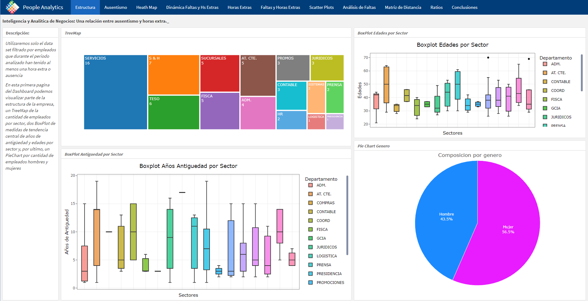
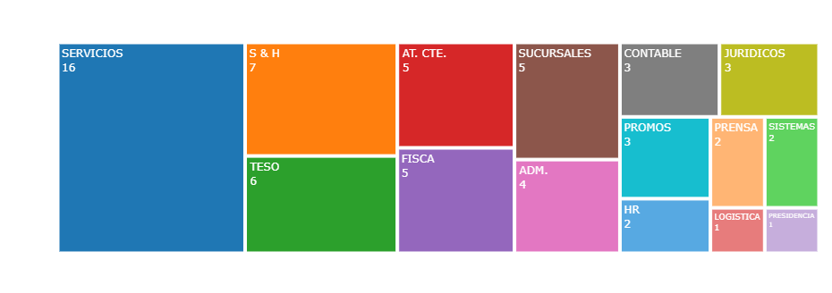
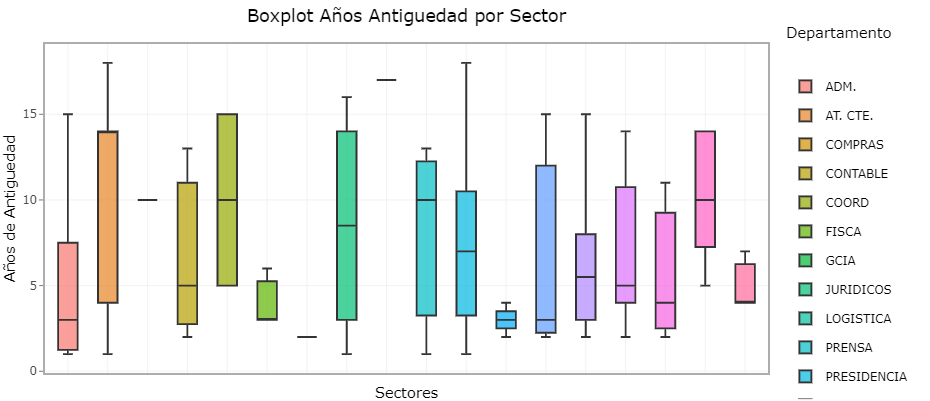
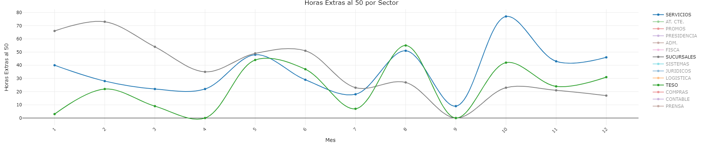
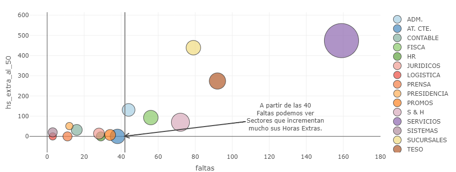

# People_Analytics
Final Proyect PA in Flexdashboard.

Proyecto Final

Proyecto terminado sobre People Analytics.

Se analizan dos variables: Ausentismo y Horas Extras

Las conclusiones del trabajo se encuentran en el dashboard:

https://rpubs.com/MGaloto/People_Analytics

# Incluye

<ui>

<li>
Estadística Descriptiva
</li>

<li>
Visualizacion
</li>

</ui>

# Paquetes de R

<ui>

<li>
{plotly}
</li>

<li>
{gganimate}
</li>

<li>
{tidyverse}
</li>

</ui>

## Dash

## Treemap

## BoxPlot

## LinePlot

## ScatterPlot

